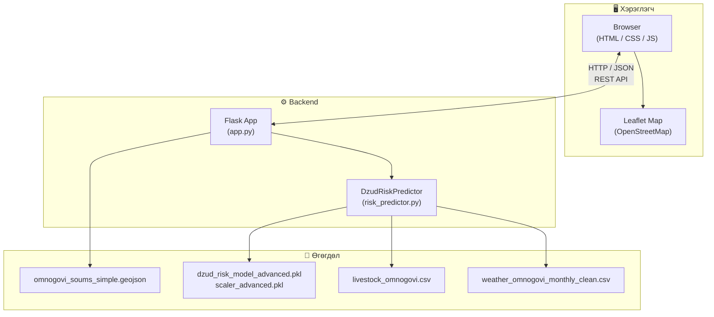
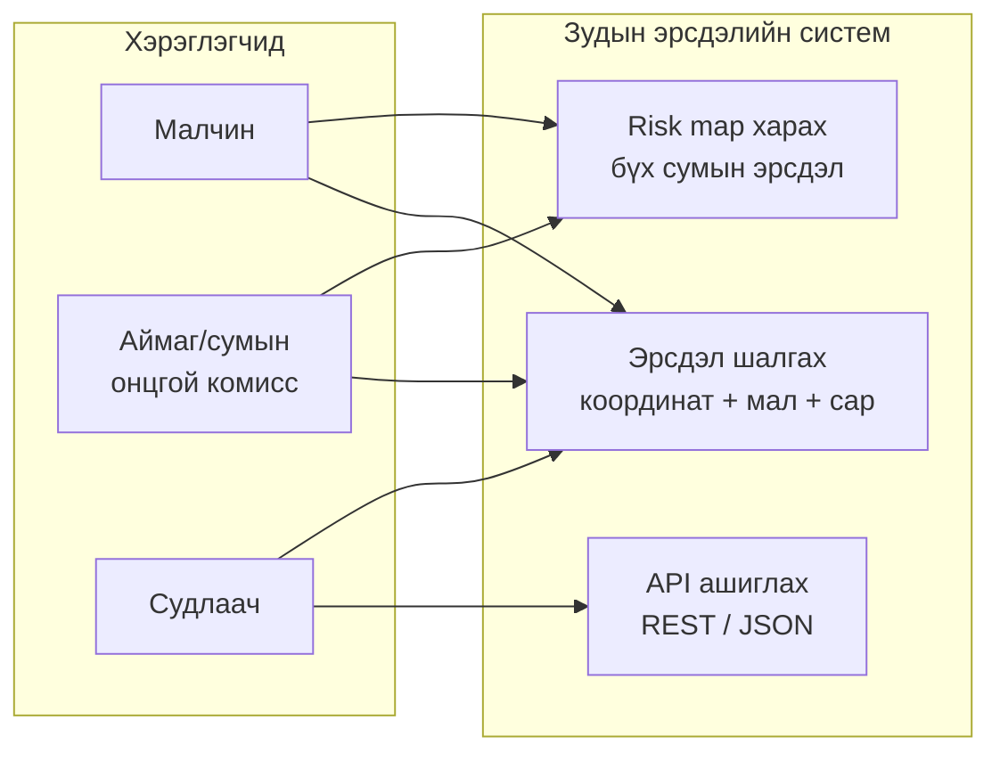
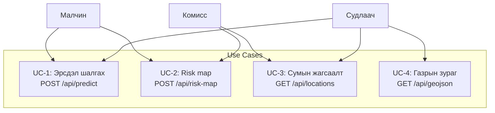
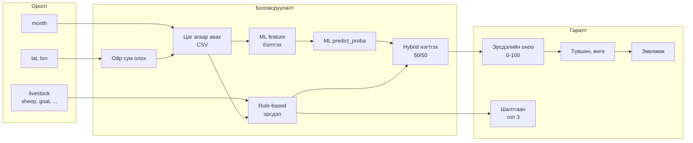
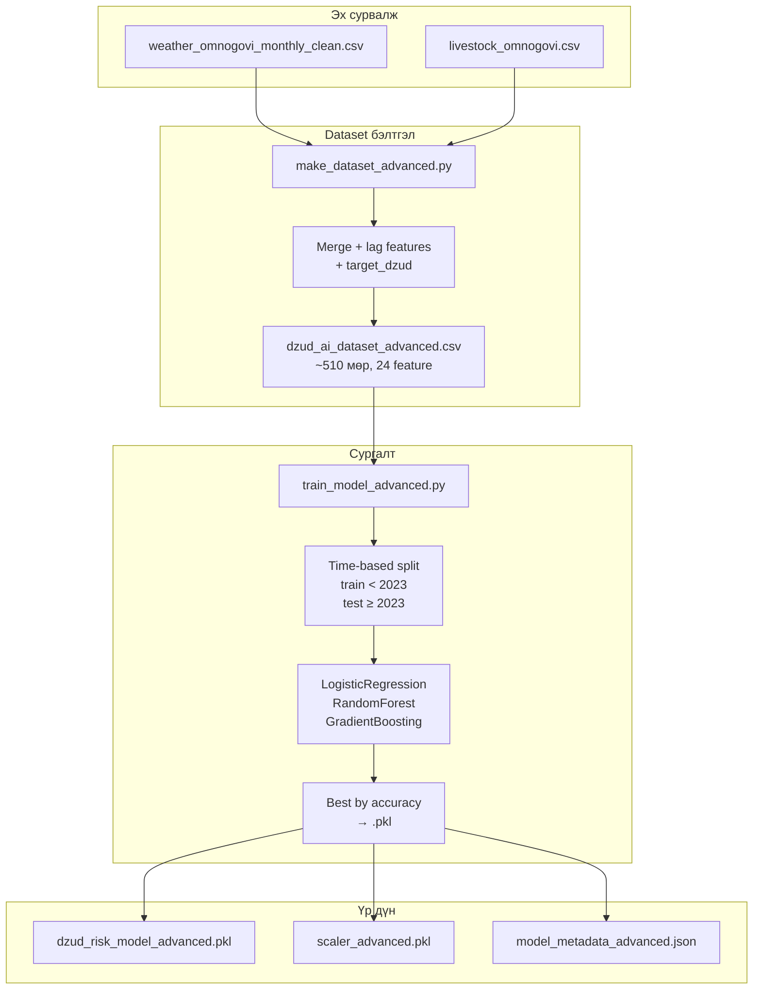
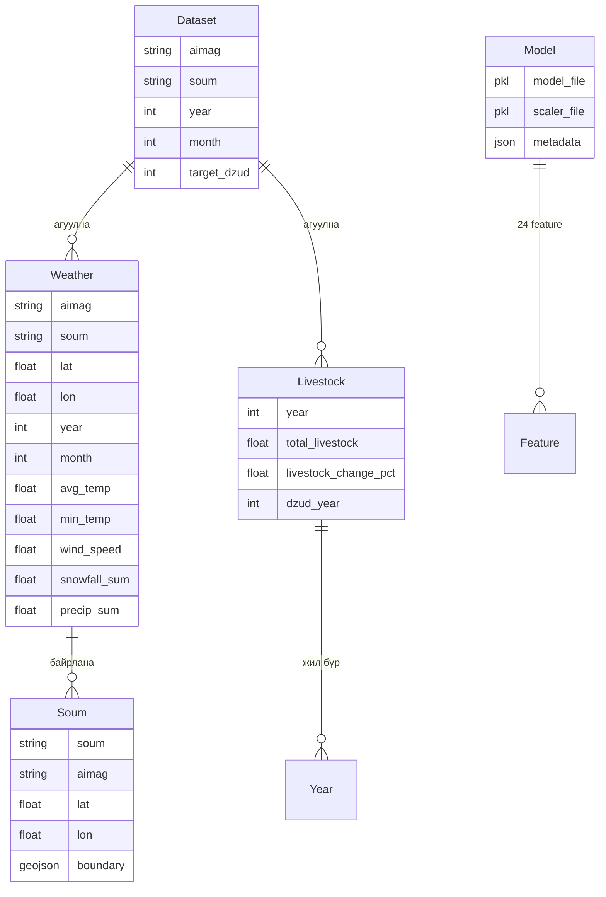
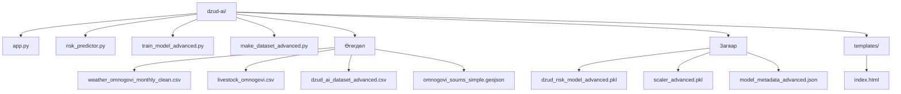
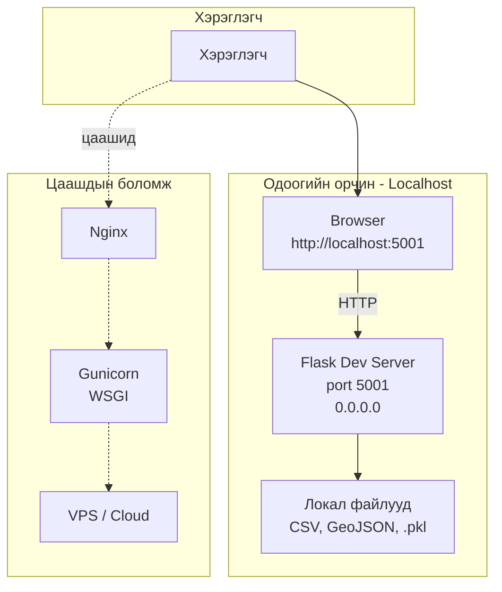
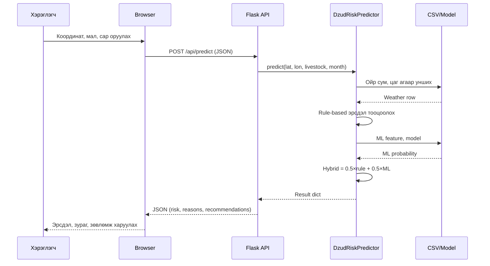
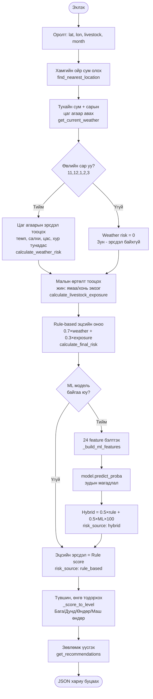

# Зудын эрсдэлийн систем — диаграммууд

Доорх диаграммуудыг [Mermaid](https://mermaid.js.org/) ашиглан зурсан. GitHub, VS Code (Mermaid extension), эсвэл [mermaid.live](https://mermaid.live) дээр нээж харна.

---

## 1. System Architecture (Системийн архитектур)



---

## 2. Use Case Diagram (UML)



**Use Case-ийн дэлгэрэнгүй:**



---

## 3. Data Flow Diagram (Өгөгдлийн урсгал)



---

## 4. Model Training Pipeline (Загвар сургах урсгал)



---

## 5. Data / File Structure (Өгөгдлийн бүтэц — DB байхгүй)



**Файлын бүтэц (мод):**



---

## 6. Deployment Diagram (Суулгах орчин)



**Дарааллын диаграмм — нэг predict хүсэлт:**



---

## 7. Risk Scoring Logic Flowchart (Эрсдэл тооцоолох логик)



---

## 8. API Endpoint-ууд (товч)

```mermaid
flowchart LR
    subgraph GET["GET"]
        G1[/]
        G2[/api/locations]
        G3[/api/geojson]
        G4[/api/health]
    end

    subgraph POST["POST"]
        P1[/api/predict]
        P2[/api/risk-map]
    end

    Client[Клиент] --> G1
    Client --> G2
    Client --> G3
    Client --> G4
    Client --> P1
    Client --> P2
```

---

Файлыг **GitHub** эсвэл **mermaid.live** дээр нээхэд диаграммууд автоматаар зураг болж харагдана. Word/Google Docs-д оруулахын тулд [mermaid.live](https://mermaid.live) дээр нэг нэгээр нь оруулаад PNG/SVG татаж аваарай.
